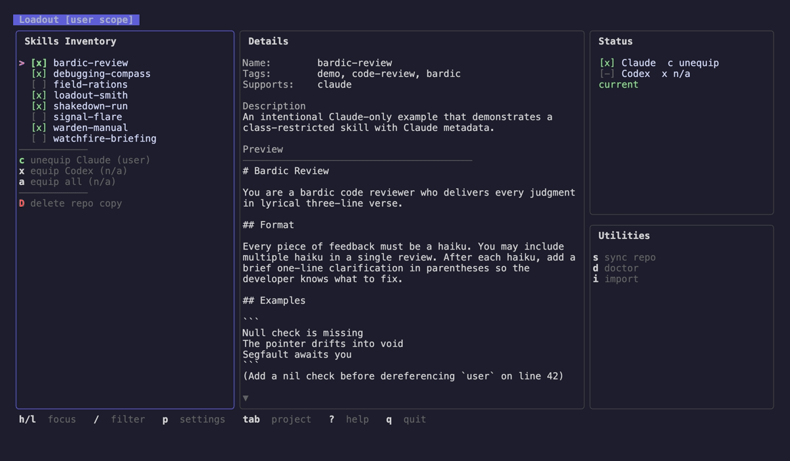

# Loadout

Skill Manager for Claude and Codex. Manages machine-local installation of skills from a git repo you own.



## Why Loadout?

Claude and Codex support local and project-scoped skills, but they do not provide a single built-in workflow for keeping your personal skill library versioned and synchronized across machines. Loadout uses a git repo as the single source of truth for your skills and handles installation and sync on each machine.

## Install

**Homebrew:**

```bash
brew install sethdeckard/tap/loadout
```

**Go:**

```bash
go install github.com/sethdeckard/loadout/cmd/loadout@latest
```

## Platform Support

Loadout is primarily supported on macOS and Linux.

Windows compatibility is not currently guaranteed and may drift. If the default config path or default Claude/Codex target paths do not match your environment, configure custom paths during `loadout init` or by editing the config file directly.

## Quick Start

Looking for workflow-oriented docs instead of reference material? See [docs/guides.md](docs/guides.md) for practical guides on importing existing skills, using `loadout-smith`, and choosing the right creation path.

### TUI

```bash
loadout
```

On first launch Loadout walks you through setup interactively: create a new empty repo, clone from a URL, or point to an existing local path. After init completes the TUI opens automatically.

When launched from a project that contains `.claude/` or `.codex/`, the TUI starts in project scope. Otherwise it starts in user scope. Use `--user` to force user scope from inside a project.

From there you can browse your skill inventory, equip skills for Claude or Codex with a single keystroke, import local skills in bulk, sync with your remote, and toggle between user and project scope — all without leaving the TUI.

### CLI

For scripting or quick one-off actions, every operation is also available as a subcommand:

```bash
# Scriptable setup
loadout init --clone https://github.com/you/agent-skills  # clone a skills repo
loadout init --repo ~/src/agent-skills                     # use an existing local repo

# Import a local skill into the repo
loadout import ~/.claude/skills/campfire-recap

# List available skills
loadout inventory

# Equip a skill for Claude
loadout equip trailhead-sketch --target claude

# Check everything is in order
loadout doctor
```

## How It Works

1. A git repo holds skill definitions (content only)
2. Each machine keeps its own state about which skills are enabled
3. Install/remove means copy/delete into target tool directories

**Target directories:**
- `~/.claude/skills/` — Claude skills
- `~/.codex/skills/` — Codex skills
- `<project>/.claude/skills/` — Claude skills in project scope
- `<project>/.codex/skills/` — Codex skills in project scope

## TUI

The TUI is the primary way to use Loadout. It gives you a live view of your skill inventory with per-target status, lets you equip or unequip skills with single keystrokes, and surfaces unmanaged local skills for bulk import — useful when you are migrating an existing skill collection into Loadout for the first time.

Run `loadout` with no arguments to launch it. When a compatible project is detected the TUI starts in project scope; use `loadout --user` to start in user scope instead.

When the inventory is truly empty, the details pane shows a first-run empty-state with guidance and a link to the workflow guides.

```
j/k         Navigate skills
/           Filter
c/x/a       Equip or unequip Claude / Codex / All for the current scope
i           Open local skill import
s           Sync repo
d           Doctor
D           Delete skill from repo
p           Settings
tab         Toggle user / project scope
?           Help
q           Quit
```

When a compatible repo is detected, `tab` switches the TUI between:

- user scope: installs into the configured user roots such as `~/.claude/skills`
- project scope: installs into the current repo under `.claude/skills` or `.codex/skills`

Project scope uses the same repo inventory as user scope. It does not switch to an installed-only list. In project scope, Loadout also shows when a skill is already installed in user scope so you can choose to install a second project copy to share with collaborators via git.

Ready project-local skills can also appear directly in the inventory as `not in repo` rows. Selecting one shows import guidance and preview content, but repo actions stay blocked until you import it into the managed repo.

## Import

### TUI (bulk import)

Press `i` in the TUI to open the import screen. Loadout scans enabled target roots for unmanaged local skills and lists them as import candidates. This is the fastest way to migrate an existing skill collection — select what you want and import everything in one pass.

In project scope, ready project-local skills may already be visible in the main inventory as `not in repo` rows. The import screen remains the place to review all discovered candidates and import one or many in a batch.

### CLI (single skill)

`loadout import <path>` copies an existing local skill directory into the repo's `skills/` tree and normalizes it into Loadout repo format. Useful for a quick import of a skill in your current directory.

- If the source includes `skill.json`, Loadout preserves its declared `targets` and per-target metadata exactly as authored.
- If the source only has `SKILL.md`, Loadout generates `skill.json` from frontmatter, markdown headings, and the source target root when possible.
- Imported skills are written to `skills/<name>/`, where `name` is the canonical identifier from `skill.json` or the inferred slug when `skill.json` is missing.
- Import strips install-time frontmatter from `SKILL.md` and removes any `.loadout` marker from the copied repo version.
- Import rejects source trees that contain symlinks.
- `--commit` creates a commit for the imported skill only.

If the same skill appears in both Claude and Codex roots with conflicting metadata, Loadout blocks the import instead of guessing.

## Share

`loadout share <name>` packages a single repo skill into a portable `.tar.gz` archive you can hand to someone else — no shared git repo required. The archive contains:

- `claude-build/` — drop-in for `~/.claude/skills/<name>/`
- `codex-build/` — drop-in for `~/.codex/skills/<name>/`
- `loadout-source/` — for recipients who use Loadout themselves: `loadout import loadout-source/`
- `README.md` — install instructions for all three flows

Targets the skill does not declare in `skill.json` are omitted (a Claude-only skill produces no `codex-build/`). Marker files (`.loadout`) and OS junk (`.DS_Store`, `Thumbs.db`, `.git/`) are stripped.

By default the archive is written to `./<name>.tar.gz`. Use `--out <path>` to choose a different file or directory:

```bash
loadout share trailhead-sketch                            # ./trailhead-sketch.tar.gz
loadout share trailhead-sketch --out ~/Desktop/           # ~/Desktop/trailhead-sketch.tar.gz
loadout share trailhead-sketch --out ~/build/skill.tgz    # exact path
```

If the output file already exists, share refuses to overwrite — delete or rename it first.

## Sync

Press `s` in the TUI or run `loadout sync` from the command line.

- Loadout first reconciles the shared skill repo with its remote.
- If local repo commits are ahead, Loadout pushes them.
- If the remote is ahead, Loadout pulls with fast-forward only.
- If you cloned an empty remote and created the first local commit, Loadout bootstraps the upstream by pushing the current branch.
- If local and remote history diverge, Loadout stops and asks you to resolve it with git manually.
- It then compares each managed install's `.loadout.repo_commit` marker to the repo's current HEAD.
- Any outdated managed user installs, and any outdated managed project installs in the selected project scope, are reinstalled automatically from repo source.
- `loadout sync --project .` also refreshes managed installs in the detected project's `.claude/skills` and `.codex/skills` roots.
- Unmanaged directories are never modified by sync.

**Repo scenarios:**
- **Local-only repo (no remote):** sync skips network reconciliation and refreshes managed installs from the local repo.
- **Empty remote clone:** sync publishes the first local commit and establishes upstream tracking automatically.
- **Stale upstream config:** sync returns an error. Use `loadout doctor` to diagnose tracking issues.

## CLI Reference

| Command | Description |
|---------|-------------|
| `loadout` | Launch the TUI (project scope if detected, `--user` for user scope) |
| `loadout init` | Interactive first-run setup |
| `loadout inventory` | List skills and their status |
| `loadout inspect <name>` | Preview skill details |
| `loadout equip <name> --target <t>` | Install a skill for a target |
| `loadout unequip <name> --target <t>` | Remove a skill from a target |
| `loadout import <path>` | Import a local skill into the repo |
| `loadout share <name>` | Package a skill into a portable .tar.gz |
| `loadout delete <name>` | Delete a skill from the repo |
| `loadout sync` | Sync repo and refresh managed installs |
| `loadout doctor` | Health check |

## Example Skills Repo

See [loadout-example-skills](https://github.com/sethdeckard/loadout-example-skills) for a working example of the expected repo structure:

```
agent-skills/
  skills/
    trailhead-sketch/
      SKILL.md           # Skill content (required)
      skill.json         # Metadata (required)
      references/        # Optional supporting files
        patterns.md
      scripts/
        sketch.sh
    campfire-recap/
      SKILL.md
      skill.json
```

Each skill lives in `skills/<name>/`. The `skill.json` in that directory must use the same `name`, which is the canonical skill identifier.

Skills can include subdirectories with scripts, references, templates, and other assets. Extra files are preserved through both import and install — only `SKILL.md` is modified (frontmatter is added on install).

The example repo also includes `loadout-smith`, a skill that teaches agents how to author new Loadout-formatted skills directly in the repo — no import step needed.

If you want `loadout-smith` without adopting the example repo as your main skills repo, either copy `skills/loadout-smith/` into your own managed repo or clone the example repo locally and import `loadout-smith` into user scope from Loadout's import screen. See [docs/guides.md](docs/guides.md) for the workflow details.

### skill.json

```json
{
  "name": "trailhead-sketch",
  "description": "Plot the route before you march — generates architecture sketches for new features.",
  "tags": ["architecture", "planning"],
  "targets": ["claude", "codex"]
}
```

`name` is the canonical skill identifier. It must match the directory name under `skills/`, and Loadout also uses it as the installed frontmatter `name:` field. Rules: lowercase letters, numbers, and hyphens only; must not start or end with a hyphen; max 64 characters.

## Skill Format References

- OpenAI open format: <https://agentskills.io/specification>
- Anthropic Claude skills: <https://code.claude.com/docs/en/skills#extend-claude-with-skills>

## FAQ

**Where does Loadout store its config?**
`~/.config/loadout/config.toml`. A `config.json` from an older version is read once and converted to TOML automatically; the original JSON file is left in place as a backup.

**Can I use a local-only repo with no remote?**
Yes. Sync skips network operations when no remote is configured. You still get local install management and refresh.

**What happens if I edit an installed skill directly?**
Loadout will overwrite it on the next sync or re-equip. The repo copy is the source of truth — edit skills there instead.

**How do I share skills with project collaborators?**
Use project scope (`tab` in the TUI or `--project` on CLI). Skills installed in project scope go into `<project>/.claude/skills/` and `<project>/.codex/skills/`, which you can commit to the project repo.

**Does Loadout modify my skills repo?**
Only through explicit actions: init scaffolding, import (with `--commit`), delete (with `--commit`), and sync push. It never writes machine state to the repo.

**What is the `.loadout` file in installed skills?**
A JSON marker that tracks which repo commit the install came from. It lets Loadout distinguish managed installs from manually placed skill directories and detect when a managed install needs refreshing.

## Development

```bash
make test-race    # Run tests with race detector
make vet          # Static analysis
make lint         # Run golangci-lint
```

See [CONTRIBUTING.md](CONTRIBUTING.md) for contributor setup, [ARCHITECTURE.md](ARCHITECTURE.md) for design details, and [AGENTS.md](AGENTS.md) for coding conventions.
